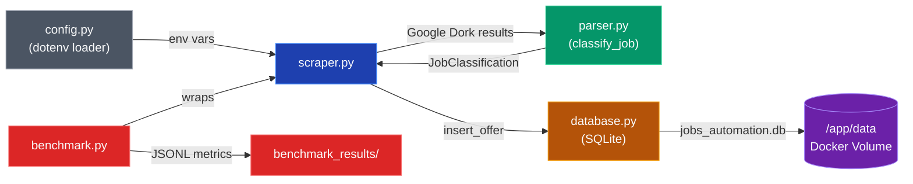

<p align="center">
  
  
  
  
  
  
</p>

# ATS Job Automator

**Idioma / Language:** [Espanol](#espanol) | [English](#english)

---

<a id="espanol"></a>

# Espanol

> **Motor de automatizacion de postulaciones laborales con arquitectura DevSecOps-first.**
> Apunta directamente a portales ATS corporativos (Lever, Greenhouse) usando automatizacion de navegador stealth, clasificacion de ofertas basada en regex, y una capa de persistencia segura en SQLite — sin pasar por LinkedIn.

---

## Tabla de Contenidos

- [Arquitectura del Sistema](#arquitectura-del-sistema)
- [Flujo de Interaccion entre Modulos](#flujo-de-interaccion-entre-modulos)
- [Capa de Ciberseguridad](#capa-de-ciberseguridad)
- [Metricas de Benchmarking](#metricas-de-benchmarking)
- [Guia de Instalacion Rapida](#guia-de-instalacion-rapida)
- [Despliegue con Docker](#despliegue-con-docker)
- [Flujo de Trabajo Git](#flujo-de-trabajo-git)
- [Estructura del Proyecto](#estructura-del-proyecto)
- [Stack Tecnologico](#stack-tecnologico)
- [Licencia](#licencia-es)

---

## Arquitectura del Sistema

El sistema sigue una **arquitectura de pipeline** con cuatro modulos desacoplados, cada uno con una responsabilidad unica:

```
+-------------------------------------------------------------------------+
|                        ATS JOB AUTOMATOR PIPELINE                       |
|                                                                         |
|   +----------+     +----------+     +----------+     +--------------+   |
|   | scraper  |---->|  parser  |---->| database |---->|  benchmark   |   |
|   |   .py    |     |   .py    |     |   .py    |     |     .py      |   |
|   +----------+     +----------+     +----------+     +--------------+   |
|        |                |                |                   |           |
|   Playwright       Motor Regex     SQLite + WAL      memory_profiler    |
|   Modo Stealth     Compilado \b    Queries Param.    perf_counter        |
|   Google Dorks     Bilingue ES/EN  CHECK constraints  Logs JSONL        |
|   Anti-Deteccion   Frozen Dataclass Columnas Index.  psutil CPU%        |
|                                                                         |
|   +-----------------------------------------------------------------+   |
|   |                    CAPA DE INFRAESTRUCTURA                       |   |
|   |   config.py (dotenv) | Dockerfile | CI/CD (GitHub Actions)      |   |
|   +-----------------------------------------------------------------+   |
+-------------------------------------------------------------------------+
```

| Modulo | Responsabilidad | Tecnologia Clave |
|--------|----------------|-----------------|
| **`scraper.py`** | Ejecuta Google Dorks contra portales ATS, extrae listados de empleo | Playwright (asincrono, headless, stealth) |
| **`parser.py`** | Clasifica cada oferta por modalidad de trabajo y alcance geografico | Regex compilado con `\b` word boundaries |
| **`database.py`** | Persiste ofertas con deduplicacion, seguimiento de estado y auditoria | SQLite3, journal WAL, queries parametrizadas |
| **`benchmark.py`** | Mide tiempo de ejecucion, RAM pico/promedio, utilizacion de CPU | `memory_profiler`, `psutil`, `time.perf_counter` |
| **`config.py`** | Cargador centralizado y seguro de variables de entorno | `python-dotenv`, validacion fail-fast |

---

## Flujo de Interaccion entre Modulos


**Ejecucion paso a paso:**

1. **`config.py`** carga `.env` y valida las variables requeridas en tiempo de importacion. Falla inmediatamente con un error claro si `.env` no existe o las variables criticas estan vacias.
2. **`scraper.py`** lanza una instancia de Chromium en modo stealth e itera a traves de 5 Google Dorks deterministicos apuntando a `lever.co` y `greenhouse.io`.
3. Para cada resultado, **`parser.classify_job(title, url)`** ejecuta patrones regex compilados contra el texto combinado de titulo + URL y devuelve un dataclass congelado `JobClassification`.
4. El scraper llama a **`database.insert_offer()`** con bindings parametrizados `?` — la modalidad clasificada, el nombre de empresa inferido y el tipo de ATS se almacenan en la tabla `offers`.
5. **`benchmark.py`** envuelve todo el pipeline, muestreando RAM cada 500ms via `memory_profiler` y registrando el tiempo wall-clock con precision de nanosegundos.

---

## Capa de Ciberseguridad

La seguridad esta integrada en cada capa — no anadida como ocurrencia tardia.

### Evasion de WAF y Stealth (scraper.py)

El scraper implementa **tres capas de anti-deteccion** para evadir Web Application Firewalls comerciales:

| Capa | Tecnica | Implementacion |
|------|---------|---------------|
| **Args del Navegador** | Desactivar indicadores de automatizacion | `--disable-blink-features=AutomationControlled` |
| **Inyeccion JS** | Sobreescribir propiedades de fingerprint | `navigator.webdriver = false`, spoof de `chrome.runtime`, override de permisos |
| **Comportamental** | Patrones de navegacion humana | Delays aleatorios (2-10s), viewport realista (1920x1080), timezone `Europe/Madrid` |

```python
# Script stealth inyectado en cada contexto de pagina
Object.defineProperty(navigator, 'webdriver', { get: () => false });
window.chrome = { runtime: {} };
```

### Mitigacion de SQL Injection (database.py)

Todas las operaciones de base de datos usan **queries parametrizadas** con placeholders `?` — cero concatenacion de strings:

```python
# [SEGURO] Binding parametrizado
cursor.execute("INSERT INTO offers (...) VALUES (?, ?, ?, ...)", (company, title, url, ...))

# [INSEGURO] Nunca usado: formateo de strings
cursor.execute(f"INSERT INTO offers (...) VALUES ('{company}', '{title}', ...)")
```

Defensas adicionales:
- **CHECK constraint** en la columna `status` fuerza `PENDING | APPLIED | FAILED | SKIPPED` a nivel de base de datos.
- **Validacion en Python** via frozenset `VALID_STATUSES` rechaza valores invalidos antes de que lleguen a SQLite.
- **UNIQUE constraint** en `url` previene entradas duplicadas.

### Auditoria de robots.txt

El scraper apunta a **resultados de Google Search** — no a portales ATS directamente — como capa de descubrimiento inicial. Esta decision de diseno implica:

- **El robots.txt de Google** gobierna la fase de busqueda. El scraper respeta el rate-limiting via delays similares a los humanos.
- **Las paginas de portales ATS** (Lever, Greenhouse) son ofertas de empleo publicas disenadas para ser indexadas. Estos portales permiten explicitamente el rastreo de paginas de ofertas via su `robots.txt` (ej. `lever.co/robots.txt` permite rutas `/jobs/`).
- **Sin bypass de autenticacion** — el scraper nunca elude login walls ni tokens de sesion.

### Gestion de Secretos

| Proteccion | Mecanismo |
|-----------|-----------|
| `.env` nunca se commitea | Regla en `.gitignore` + template `.env.example` |
| Fail-fast en variables faltantes | `config.py` termina con mensaje en stderr si las variables requeridas no estan configuradas |
| Auditoria de seguridad estatica | Escaneos de **Bandit** en cada push via GitHub Actions CI |
| Seguridad del contenedor | Usuario non-root `appuser:1001` en Docker, `PYTHONDONTWRITEBYTECODE=1` |

---

## Metricas de Benchmarking

### Ejecutar el Benchmark

```bash
# Ejecucion local
python benchmark.py

# Dentro de Docker
docker run -v ats_data:/app/data --env-file .env ats-automator python benchmark.py
```

### Que se Mide

| Metrica | Herramienta | Precision |
|---------|------------|-----------|
| Tiempo de ejecucion wall-clock | `time.perf_counter` | Resolucion de nanosegundos |
| Uso pico de RAM (MiB) | `memory_profiler` | Muestreo RSS cada 500ms |
| Uso promedio de RAM (MiB) | `memory_profiler` | Calculado de todas las muestras |
| Utilizacion de CPU (%) | `psutil.Process` | Medicion por proceso |
| Ofertas insertadas | `scraper.run_scraper()` | Conteo exacto |
| Errores encontrados | `scraper.run_scraper()` | Conteo exacto |

### Formato de Salida

Los resultados se agregan como lineas JSON estructuradas a `benchmark_results/benchmark_log.jsonl`:

```json
{
  "timestamp": "2026-06-03T20:42:00+00:00",
  "elapsed_seconds": 47.832,
  "peak_memory_mib": 187.45,
  "avg_memory_mib": 142.30,
  "baseline_memory_mib": 38.12,
  "memory_samples_count": 96,
  "cpu_percent": 23.4,
  "scraper_summary": {
    "total_dorks": 5,
    "total_inserted": 18,
    "total_errors": 0
  }
}
```

Cada ejecucion agrega una nueva linea — permitiendo el seguimiento historico de regresion de rendimiento entre deploys.

---

## Guia de Instalacion Rapida

### Prerrequisitos

- **Python 3.11+**
- **Git**
- **Docker** (opcional, para despliegue containerizado)

### Instalacion Local

```bash
# 1. Clonar el repositorio
git clone https://github.com/alej-developer/looking-jobs.git
cd looking-jobs

# 2. Crear y activar entorno virtual
python -m venv .venv
.venv\Scripts\activate          # Windows (PowerShell)
# source .venv/bin/activate     # macOS / Linux

# 3. Instalar todas las dependencias
pip install -r requirements.txt

# 4. Instalar navegador Chromium de Playwright
playwright install chromium

# 5. Configurar variables de entorno
copy .env.example .env          # Windows
# cp .env.example .env          # macOS / Linux

# 6. Editar .env con tus valores reales (campos OBLIGATORIOS):
#    CANDIDATE_FULL_NAME=Tu Nombre
#    CANDIDATE_EMAIL=tu@email.com

# 7. Inicializar la base de datos
python -c "from database import init_db; init_db()"

# 8. Ejecutar el scraper
python scraper.py

# 9. Ejecutar el benchmark
python benchmark.py
```

---

## Despliegue con Docker

### Construir y Ejecutar

```bash
# Construir la imagen
docker build -t ats-automator .

# Ejecutar con volumen persistente para la base de datos y tu .env
docker run \
  --name ats-bot \
  -v ats_data:/app/data \
  --env-file .env \
  ats-automator

# Ejecutar el benchmark dentro del contenedor
docker run \
  -v ats_data:/app/data \
  --env-file .env \
  ats-automator python benchmark.py
```

### Persistencia de Volumen

La base de datos SQLite `jobs_automation.db` vive dentro del directorio `/app/data`, declarado como `VOLUME` en Docker. Esto garantiza:

- Los datos sobreviven reinicios del contenedor y reconstrucciones de imagen
- Puedes hacer backup del volumen de forma independiente
- Multiples contenedores pueden apuntar a los mismos datos

```bash
# Inspeccionar el volumen
docker volume inspect ats_data

# Backup de la base de datos
docker cp ats-bot:/app/data/jobs_automation.db ./backup_jobs.db
```

---

## Flujo de Trabajo Git

Este proyecto sigue **Conventional Commits** con **commits atomicos y de alta frecuencia** — cada commit representa un unico cambio logico:

| Prefijo | Proposito | Ejemplo |
|---------|----------|---------|
| `feat:` | Nueva funcionalidad o modulo | `feat: init sqlite database schema with security indices` |
| `ci:` | CI/CD e infraestructura | `ci: setup github actions pipeline and docker containerization` |
| `docs:` | Cambios en documentacion | `docs: achieve production-ready readme documentation` |
| `fix:` | Correccion de errores | `fix: handle edge case in regex classifier` |
| `refactor:` | Reestructuracion de codigo | `refactor: extract URL parser into utility function` |
| `test:` | Adiciones/cambios en tests | `test: add integration tests for insert_offer` |

### Historial de Commits

```
7d58bb1 ci: setup github actions pipeline and docker containerization
bed3b41 feat: implement stealth playwright scraper with google dorks
c91f4a5 feat: add regex-based job classification engine
88aa682 feat: init sqlite database schema with security indices
ede81ad feat: initial project scaffold with security-first configuration
```

### Pipeline CI/CD (GitHub Actions)

Cada push a `main` dispara tres jobs automatizados:

```
Push a main
    |-- [Auditoria de Seguridad] Bandit -- severidad >= media, artifact JSON
    |-- [Lint] Flake8 -------------------- max-line 100, complejidad 12
    +-- [Tests Unitarios] Pytest ---------- .env auto-generado desde template
```

---

## Estructura del Proyecto

```
looking-jobs/
├── .github/
│   └── workflows/
│       └── ci.yml              # GitHub Actions: bandit + flake8 + pytest
│
├── src/
│   ├── __init__.py
│   ├── scraper/
│   │   ├── __init__.py
│   │   └── base.py             # Clase base abstracta: BaseScraper
│   ├── applicator/
│   │   ├── __init__.py
│   │   └── base.py             # Clase base abstracta: BaseApplicator
│   ├── models/
│   │   ├── __init__.py
│   │   └── job.py              # SQLAlchemy ORM + esquema Pydantic
│   └── utils/
│       ├── __init__.py
│       └── logger.py           # Logging estructurado con Rich
│
├── data/                       # Datos en ejecucion (DB aqui, git-ignored)
│   └── .gitkeep
├── tests/
│   ├── __init__.py
│   └── test_config.py          # Smoke tests de invariantes de seguridad
├── docs/
│   └── .gitkeep
│
├── config.py                   # Cargador seguro de env-vars (python-dotenv)
├── database.py                 # Persistencia SQLite (queries parametrizadas)
├── parser.py                   # Motor de clasificacion regex
├── scraper.py                  # Playwright stealth + Google Dorks
├── benchmark.py                # Profiler de rendimiento (tiempo + RAM + CPU)
├── main.py                     # Punto de entrada de la aplicacion
│
├── Dockerfile                  # Build multi-stage (base Playwright)
├── .dockerignore               # Contexto de build minimo
├── requirements.txt            # Dependencias de produccion fijadas
├── pyproject.toml              # Metadatos del proyecto + config de herramientas
│
├── .env.example                # Template seguro (commiteado)
├── .gitignore                  # Exclusiones estrictas (.env, .db, .venv, etc.)
└── README.md                   # <-- Estas aqui
```

---

## Stack Tecnologico

| Categoria | Tecnologia | Proposito |
|-----------|-----------|----------|
| **Lenguaje** | Python 3.11+ | Type hints modernos, sentencias `match`, rendimiento |
| **Automatizacion de Navegador** | Playwright (asincrono) | Chromium headless stealth con anti-deteccion |
| **Base de Datos** | SQLite3 (modo WAL) | Persistencia ligera, zero-config, ACID-compliant |
| **Validacion de Datos** | Pydantic v2 | Validacion de esquemas para datos de ofertas entrantes |
| **ORM** | SQLAlchemy 2.0 | Modelos declarativos para soporte futuro de migraciones |
| **Cliente HTTP** | httpx | HTTP async-first con connection pooling |
| **Logging** | Rich | Salida de consola coloreada y estructurada con tracebacks |
| **Profiling** | memory_profiler + psutil | Muestreo RSS y medicion de CPU |
| **Seguridad** | Bandit | Analisis estatico de vulnerabilidades comunes en Python |
| **Linting** | Flake8 + Ruff | Enforcement de estilo y calidad de codigo |
| **CI/CD** | GitHub Actions | Pipeline automatizado de seguridad, lint y tests |
| **Containerizacion** | Docker (multi-stage) | Entorno de produccion reproducible y aislado |

---

<a id="licencia-es"></a>

## Licencia

Este proyecto esta licenciado bajo la Licencia MIT. Ver [`LICENSE`](LICENSE) para mas detalles.

---
---

<a id="english"></a>

# English

> **Automated job application engine with a DevSecOps-first architecture.**
> Targets corporate ATS portals directly (Lever, Greenhouse) using stealth browser automation, regex-based job classification, and a secure SQLite persistence layer — bypassing LinkedIn entirely.

---

## Table of Contents

- [System Architecture](#system-architecture)
- [Module Interaction Flow](#module-interaction-flow)
- [Cybersecurity Layer](#cybersecurity-layer)
- [Benchmarking Metrics](#benchmarking-metrics)
- [Quick Start Guide](#quick-start-guide)
- [Docker Deployment](#docker-deployment)
- [Git Workflow](#git-workflow)
- [Project Structure](#project-structure)
- [Tech Stack](#tech-stack)
- [License](#license)

---

## System Architecture

The system follows a **pipeline architecture** with four decoupled modules, each with a single responsibility:

```
+-------------------------------------------------------------------------+
|                        ATS JOB AUTOMATOR PIPELINE                       |
|                                                                         |
|   +----------+     +----------+     +----------+     +--------------+   |
|   | scraper  |---->|  parser  |---->| database |---->|  benchmark   |   |
|   |   .py    |     |   .py    |     |   .py    |     |     .py      |   |
|   +----------+     +----------+     +----------+     +--------------+   |
|        |                |                |                   |           |
|   Playwright       Regex Engine     SQLite + WAL      memory_profiler   |
|   Stealth Mode     Compiled \b      Parameterized Q   perf_counter      |
|   Google Dorks     Bilingual ES/EN  CHECK constraints  JSONL logs       |
|   Anti-Detection   Frozen Dataclass Indexed columns    psutil CPU%      |
|                                                                         |
|   +-----------------------------------------------------------------+   |
|   |                    INFRASTRUCTURE LAYER                          |   |
|   |   config.py (dotenv) | Dockerfile | CI/CD (GitHub Actions)      |   |
|   +-----------------------------------------------------------------+   |
+-------------------------------------------------------------------------+
```

| Module | Responsibility | Key Technology |
|--------|---------------|----------------|
| **`scraper.py`** | Executes Google Dork queries against ATS portals, extracts job listings | Playwright (async, headless, stealth) |
| **`parser.py`** | Classifies each offer by work modality and geographic scope | Compiled regex with `\b` word boundaries |
| **`database.py`** | Persists offers with deduplication, status tracking, and audit trail | SQLite3, WAL journal, parameterized queries |
| **`benchmark.py`** | Measures execution time, peak/avg RAM, CPU utilization | `memory_profiler`, `psutil`, `time.perf_counter` |
| **`config.py`** | Centralized, secure environment variable loader | `python-dotenv`, fail-fast validation |

---

## Module Interaction Flow



**Step-by-step execution:**

1. **`config.py`** loads `.env` and validates required variables at import time. Fails fast with a clear error if `.env` is missing or critical vars are empty.
2. **`scraper.py`** launches a stealth Chromium instance and iterates through 5 deterministic Google Dork queries targeting `lever.co` and `greenhouse.io`.
3. For each result, **`parser.classify_job(title, url)`** runs compiled regex patterns against the combined title + URL text and returns a frozen `JobClassification` dataclass.
4. The scraper calls **`database.insert_offer()`** with parameterized `?` bindings — the classified modality, inferred company name, and ATS type are stored in the `offers` table.
5. **`benchmark.py`** wraps the entire pipeline, sampling RAM every 500ms via `memory_profiler` and recording wall-clock time with nanosecond precision.

---

## Cybersecurity Layer

Security is embedded at every layer — not bolted on as an afterthought.

### WAF Evasion & Stealth (scraper.py)

The scraper implements **three layers of anti-detection** to bypass commercial Web Application Firewalls:

| Layer | Technique | Implementation |
|-------|-----------|----------------|
| **Browser Args** | Disable automation indicators | `--disable-blink-features=AutomationControlled` |
| **JS Injection** | Override fingerprint properties | `navigator.webdriver = false`, `chrome.runtime` spoof, permissions override |
| **Behavioral** | Human-like browsing patterns | Randomized delays (2-10s), realistic viewport (1920x1080), `Europe/Madrid` timezone |

```python
# Stealth init script injected into every page context
Object.defineProperty(navigator, 'webdriver', { get: () => false });
window.chrome = { runtime: {} };
```

### SQL Injection Mitigation (database.py)

All database operations use **parameterized queries** with `?` placeholders — zero string concatenation:

```python
# [SAFE] Parameterized binding
cursor.execute("INSERT INTO offers (...) VALUES (?, ?, ?, ...)", (company, title, url, ...))

# [UNSAFE] Never used: string formatting
cursor.execute(f"INSERT INTO offers (...) VALUES ('{company}', '{title}', ...)")
```

Additional defenses:
- **CHECK constraint** on `status` column enforces `PENDING | APPLIED | FAILED | SKIPPED` at the database level.
- **Python-side validation** via `VALID_STATUSES` frozenset rejects invalid values before they reach SQLite.
- **UNIQUE constraint** on `url` prevents duplicate entries.

### robots.txt Compliance Audit

The scraper targets **Google Search results** — not ATS portals directly — as the initial discovery layer. This design choice means:

- **Google's robots.txt** governs the search query phase. The scraper respects rate-limiting via human-like delays.
- **ATS portal pages** (Lever, Greenhouse) are public job postings designed for indexing. These portals explicitly allow crawling of job listing pages via their `robots.txt` (e.g., `lever.co/robots.txt` allows `/jobs/` paths).
- **No authentication bypass** — the scraper never circumvents login walls or session tokens.

### Secrets Management

| Protection | Mechanism |
|-----------|-----------|
| `.env` never committed | `.gitignore` rule + `.env.example` template |
| Fail-fast on missing vars | `config.py` exits with stderr message if required vars are unset |
| Static security audit | **Bandit** scans on every push via GitHub Actions CI |
| Container security | Non-root `appuser:1001` in Docker, `PYTHONDONTWRITEBYTECODE=1` |

---

## Benchmarking Metrics

### Running the Benchmark

```bash
# Local execution
python benchmark.py

# Inside Docker
docker run -v ats_data:/app/data --env-file .env ats-automator python benchmark.py
```

### What Gets Measured

| Metric | Tool | Precision |
|--------|------|-----------|
| Wall-clock execution time | `time.perf_counter` | Nanosecond resolution |
| Peak RAM usage (MiB) | `memory_profiler` | RSS sampling every 500ms |
| Average RAM usage (MiB) | `memory_profiler` | Computed from all samples |
| CPU utilization (%) | `psutil.Process` | Per-process measurement |
| Offers inserted | `scraper.run_scraper()` | Exact count |
| Errors encountered | `scraper.run_scraper()` | Exact count |

### Output Format

Results are appended as structured JSON lines to `benchmark_results/benchmark_log.jsonl`:

```json
{
  "timestamp": "2026-06-03T20:42:00+00:00",
  "elapsed_seconds": 47.832,
  "peak_memory_mib": 187.45,
  "avg_memory_mib": 142.30,
  "baseline_memory_mib": 38.12,
  "memory_samples_count": 96,
  "cpu_percent": 23.4,
  "scraper_summary": {
    "total_dorks": 5,
    "total_inserted": 18,
    "total_errors": 0
  }
}
```

Each run appends a new line — enabling historical performance regression tracking across deploys.

---

## Quick Start Guide

### Prerequisites

- **Python 3.11+**
- **Git**
- **Docker** (optional, for containerized deployment)

### Local Installation

```bash
# 1. Clone the repository
git clone https://github.com/alej-developer/looking-jobs.git
cd looking-jobs

# 2. Create and activate virtual environment
python -m venv .venv
.venv\Scripts\activate          # Windows (PowerShell)
# source .venv/bin/activate     # macOS / Linux

# 3. Install all dependencies
pip install -r requirements.txt

# 4. Install Playwright Chromium browser
playwright install chromium

# 5. Configure environment variables
copy .env.example .env          # Windows
# cp .env.example .env          # macOS / Linux

# 6. Edit .env with your actual values (REQUIRED fields):
#    CANDIDATE_FULL_NAME=Your Name
#    CANDIDATE_EMAIL=your@email.com

# 7. Initialize the database
python -c "from database import init_db; init_db()"

# 8. Run the scraper
python scraper.py

# 9. Run the benchmark
python benchmark.py
```

---

## Docker Deployment

### Build and Run

```bash
# Build the image
docker build -t ats-automator .

# Run with persistent database volume and your .env
docker run \
  --name ats-bot \
  -v ats_data:/app/data \
  --env-file .env \
  ats-automator

# Run the benchmark inside the container
docker run \
  -v ats_data:/app/data \
  --env-file .env \
  ats-automator python benchmark.py
```

### Volume Persistence

The SQLite database `jobs_automation.db` lives inside the `/app/data` directory, which is declared as a Docker `VOLUME`. This ensures:

- Data survives container restarts and image rebuilds
- You can back up the volume independently
- Multiple containers can be pointed to the same data

```bash
# Inspect the volume
docker volume inspect ats_data

# Backup the database
docker cp ats-bot:/app/data/jobs_automation.db ./backup_jobs.db
```

---

## Git Workflow

This project follows **Conventional Commits** with **atomic, high-frequency commits** — each commit represents a single logical change:

| Prefix | Purpose | Example |
|--------|---------|---------|
| `feat:` | New feature or module | `feat: init sqlite database schema with security indices` |
| `ci:` | CI/CD and infrastructure | `ci: setup github actions pipeline and docker containerization` |
| `docs:` | Documentation changes | `docs: achieve production-ready readme documentation` |
| `fix:` | Bug fixes | `fix: handle edge case in regex classifier` |
| `refactor:` | Code restructuring | `refactor: extract URL parser into utility function` |
| `test:` | Test additions/changes | `test: add integration tests for insert_offer` |

### Commit History

```
7d58bb1 ci: setup github actions pipeline and docker containerization
bed3b41 feat: implement stealth playwright scraper with google dorks
c91f4a5 feat: add regex-based job classification engine
88aa682 feat: init sqlite database schema with security indices
ede81ad feat: initial project scaffold with security-first configuration
```

### CI/CD Pipeline (GitHub Actions)

Every push to `main` triggers three automated jobs:

```
Push to main
    |-- [Security Audit] Bandit -------- severity >= medium, JSON artifact
    |-- [Lint] Flake8 ------------------ max-line 100, complexity 12
    +-- [Unit Tests] Pytest ------------ auto-generated .env from template
```

---

## Project Structure

```
looking-jobs/
├── .github/
│   └── workflows/
│       └── ci.yml              # GitHub Actions: bandit + flake8 + pytest
│
├── src/
│   ├── __init__.py
│   ├── scraper/
│   │   ├── __init__.py
│   │   └── base.py             # Abstract base class: BaseScraper
│   ├── applicator/
│   │   ├── __init__.py
│   │   └── base.py             # Abstract base class: BaseApplicator
│   ├── models/
│   │   ├── __init__.py
│   │   └── job.py              # SQLAlchemy ORM + Pydantic schema
│   └── utils/
│       ├── __init__.py
│       └── logger.py           # Rich-powered structured logging
│
├── data/                       # Runtime data (DB here, git-ignored)
│   └── .gitkeep
├── tests/
│   ├── __init__.py
│   └── test_config.py          # Security invariant smoke tests
├── docs/
│   └── .gitkeep
│
├── config.py                   # Secure env-var loader (python-dotenv)
├── database.py                 # SQLite persistence (parameterized queries)
├── parser.py                   # Regex classification engine
├── scraper.py                  # Stealth Playwright + Google Dorks
├── benchmark.py                # Performance profiler (time + RAM + CPU)
├── main.py                     # Application entry point
│
├── Dockerfile                  # Multi-stage build (Playwright base)
├── .dockerignore               # Minimal build context
├── requirements.txt            # Pinned production dependencies
├── pyproject.toml              # Project metadata + dev tools config
│
├── .env.example                # Safe template (committed)
├── .gitignore                  # Strict exclusions (.env, .db, .venv, etc.)
└── README.md                   # <-- You are here
```

---

## Tech Stack

| Category | Technology | Purpose |
|----------|-----------|---------|
| **Language** | Python 3.11+ | Modern type hints, `match` statements, performance |
| **Browser Automation** | Playwright (async) | Stealth headless Chromium with anti-detection |
| **Database** | SQLite3 (WAL mode) | Lightweight, zero-config, ACID-compliant persistence |
| **Data Validation** | Pydantic v2 | Schema validation for incoming job data |
| **ORM** | SQLAlchemy 2.0 | Declarative models for future migration support |
| **HTTP Client** | httpx | Async-first HTTP with connection pooling |
| **Logging** | Rich | Colored, structured console output with tracebacks |
| **Profiling** | memory_profiler + psutil | RSS sampling and CPU measurement |
| **Security** | Bandit | Static analysis for common Python vulnerabilities |
| **Linting** | Flake8 + Ruff | Style enforcement and code quality |
| **CI/CD** | GitHub Actions | Automated security, lint, and test pipeline |
| **Containerization** | Docker (multi-stage) | Reproducible, isolated production environment |

---

## License

This project is licensed under the MIT License. See [`LICENSE`](LICENSE) for details.

---

<p align="center">
  <strong>Built with a DevSecOps-first mindset.</strong><br>
  <em>Security is not a feature — it's the foundation.</em>
</p>
